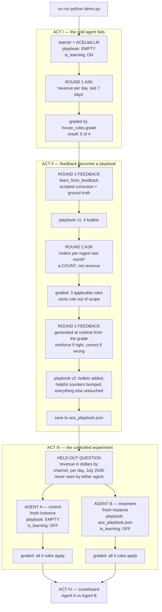
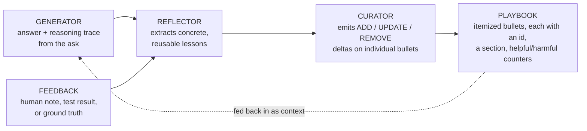

# ACE demo — Agentic Context Engineering

A runnable demonstration of [arXiv:2510.04618](https://arxiv.org/abs/2510.04618),
*Agentic Context Engineering: Evolving Contexts for Self-Improving Language Models*,
built on the authors' [`ace-framework`](https://github.com/ace-agent/ace) package.

**The claim being demonstrated:** an agent can get measurably better at a task with
**no weight updates at all** — because it wrote down what it learned, in English, into a
JSON file that gets fed back as context next time.

## Setup

Requires [uv](https://docs.astral.sh/uv/) and an Anthropic API key
([console.anthropic.com](https://console.anthropic.com/settings/keys)).

```bash
git clone https://github.com/AtishaRajpurohit/agentic_context_learning
cd agentic_context_learning

echo "ANTHROPIC_API_KEY=sk-ant-your-key-here" > .env   # your own key
```

`.env` is gitignored — no key is bundled with this repo, and you will need your own.
There is no separate install step: `uv run` creates the virtualenv and installs
dependencies from `uv.lock` on first use. Do **not** `activate` anything.

```bash
uv run python demo.py                       # pauses between acts; press enter to advance
ACE_DEMO_NOPAUSE=1 uv run python demo.py    # straight through
```

~2 minutes and ~12 API calls per run, a few cents at current Sonnet pricing. Defaults to
`anthropic/claude-sonnet-5`; override with
`ACE_DEMO_MODEL=anthropic/claude-haiku-4-5-20251001` for a faster, cheaper run.

---

## 1. The setup

You are an analyst at a fictional e-commerce company whose data warehouse has four quirks.

| # | House rule | Applies to |
|---|---|---|
| 1 | The real table is `fct_orders_v2`. The documented `orders` table is a deprecated view that silently drops marketplace rows. | every query |
| 2 | Load tests write fake orders into production. Filter `is_test = FALSE`. | every query |
| 3 | `amount` is an INTEGER in **cents**. Divide by `100.0`. | only queries reporting dollars |
| 4 | `created_at` is UTC; Finance reports on **America/Los_Angeles** days. | every query |

**Why these four rules and not something else — this is the point students should get.**
These facts are *unlearnable by reasoning*. They are internal trivia that appear nowhere in
any training corpus. A smarter model cannot deduce them; a longer chain of thought cannot
recover them; more compute does not help. The only path is **being told, and remembering.**

That isolates the experimental variable. Any improvement you see cannot be attributed to
model capability, prompt phrasing, or luck — only to retained context.

The schema shown to the agent is deliberately stale (`house_rules.py`), listing only
`orders` and `dim_customers` under the header *"data dictionary, last reviewed 14 months
ago."* No `fct_orders_v2`, no `is_test`, no hint about cents or timezones. Realistic:
warehouse docs are always out of date.

---

## 2. The structure at a glance



---

## 3. The three agents — who is who

This is the most common point of confusion. There are **three separate agent objects**, not
one that evolves.

| Agent | Lives in | Playbook | `is_learning` | Its job |
|---|---|---|---|---|
| **`learner`** | Acts I & II | starts empty, grows to ~5 bullets | **ON** | Does the learning. Produces `ace_playbook.json`. Then retires — it never answers the held-out question. |
| **`Agent A`** (`control`) | Act III | **empty** | OFF | The control. Shows what the model does with no accumulated context. |
| **`Agent B`** (`trained`) | Act III | **loaded from `ace_playbook.json`** | OFF | The treatment. Identical to A except for one constructor argument. |

**Why `learner` doesn't answer the final question:** if it did, someone could object that it
was "warmed up" by the conversation. Acts III uses two *brand-new* instances with no history,
so the only thing that survives from Act II is the JSON file. That's what makes it a clean
experiment.

**Why `is_learning=False` in Act III:** so neither agent learns anything *during* the test.
We are measuring what was already learned, not learning more mid-measurement.

**Agent A and Agent B differ by exactly one line of code:**

```python
control = ACELiteLLM(model=MODEL, ..., is_learning=False)
trained = ACELiteLLM(model=MODEL, ..., is_learning=False,
                     skillbook_path="ace_playbook.json")   # <-- the entire difference
```

---

## 4. Acts vs. Rounds — they are not the same thing

A **round** is one ask-then-feedback cycle. There are two rounds, and **round 1 straddles
Acts I and II** because its ask is the dramatic opening and its feedback is the teaching
moment.

```
ACT I     ├─ Round 1: ASK ──────────────► answer, graded 0/4
          │
ACT II    ├─ Round 1: FEEDBACK ─────────► playbook v1
          ├─ Round 2: ASK ──────────────► answer, graded
          ├─ Round 2: FEEDBACK ─────────► playbook v2 ──► ace_playbook.json
          │
ACT III   ├─ Held-out question, no feedback, two agents, graded
ACT IV    └─ Scoreboard
```

---

## 5. What each act does, in detail

### ACT I — the cold agent fails

**Files:** `demo.py` builds and asks; `house_rules.py` supplies the schema and grades.

Creates `learner` with an empty playbook and asks *"What was our total revenue per day over
the last 7 days?"*

**Expected output:** fluent, professional, completely wrong SQL — queries `orders`, no test
filter, raw cents, UTC days. **Scores 0/4.**

> **Say to the room:** "This is not a bad model. This is a competent analyst on their first
> day who has never worked here. Nothing in the weights can fix this."

### ACT II — feedback becomes a playbook

**Round 1 feedback.** A scripted senior-analyst correction plus the ground-truth SQL goes
into `learn_from_feedback()`. That single call runs the paper's full loop:



The playbook prints: ~4 bullets, each with an id, a section, and `helpful/harmful/neutral`
counters.

**Round 2 ask.** A *different* question — *"How many orders did each region place last
month?"* This is a **COUNT**, so only 3 of the 4 rules are in scope; the cents rule does not
apply to a row count. The agent answers using the playbook and is graded against the
applicable rules only.

**Round 2 feedback.** Generated **at runtime from that grade** (`round_two_feedback()` in
`demo.py`), not hardcoded — reinforcement if the agent passed, correction if it slipped.
This matters: a hardcoded "you got it wrong again" would make the demo assert something
false the moment the playbook actually works.

**The moment to point at the screen.** Compare the two playbook printouts:

- bullets that helped have their `helpful` counter tick **1 → 2**
- a new bullet is **appended**
- **everything else is byte-identical**

That is an **incremental delta update** — the paper's structural fix for *context collapse*.
The Curator never rewrites the whole document, so nothing can silently evaporate. Contrast
with "here is my context, please rewrite it," where details vanish one rewrite at a time.

Playbook is saved to `ace_playbook.json`.

### ACT III — the controlled experiment

The held-out question: *"Break down revenue in dollars by channel for each day of July
2026."* Neither agent has seen it. It is a revenue query, so **all 4 rules apply**.

Agent A answers. Agent B answers. Both graded by the same referee.

> **Expected:** A scores 0/4, B scores 4/4. In verification runs Agent B invented a
> `WITH converted AS (...)` CTE it had never been shown — it did not replay a memorized
> query, it *applied four learned rules to a new shape of problem*. That's the difference
> between memorization and transfer, and it's worth naming out loud.

### ACT IV — the scoreboard

Prints `Agent A: 0/4    Agent B: 4/4`, then tells you to open `ace_playbook.json`.

**Open that file on stage.** It is readable English. That is the entire "training run" — a
text file you can diff, review in a PR, and hand-edit if you disagree with a line.

---

## 6. The files

| File | Contains | Makes API calls? |
|---|---|---|
| **`demo.py`** | The orchestrator. Builds the three agents, runs the four acts, prints the narrative. `TRAIN` holds the two training questions; `HELD_OUT` the test question; `round_two_feedback()` the adaptive grading logic. | Yes |
| **`house_rules.py`** | The answer key and the referee. `RULES` (four `Rule` objects, each with a regex `check`), `SCHEMA` (the deliberately stale data dictionary), `grade()` / `score()` / `applicable()`. | **No** — pure Python |
| **`ACE_EXPLAINED.md`** | The paper distilled: the two failure modes, the three roles, verified benchmark numbers, a table mapping package class names → paper terminology, and honest limits. **Read this before presenting.** | No |
| **`ace_playbook.json`** | Generated output — the learned context. The punchline. | No |
| `.env` | Your `ANTHROPIC_API_KEY`. Gitignored — you create this yourself, see Setup. | — |

**Why the grader is a separate file:** so you can point at it and say *"here is the answer
key and here is the automated referee — I am not eyeballing whether the output got better."*
The scoreboard is machine-generated, not vibes.

### How the package's names map to the paper's

| Paper | `ace` package | In this demo |
|---|---|---|
| Generator | `Agent`, wrapped by `ACELiteLLM.ask()` | `learner.ask(...)` |
| Reflector | `Reflector` | inside `learn_from_feedback()` |
| Curator | `SkillManager` | inside `learn_from_feedback()` |
| Playbook | `Skillbook` of `Skill` bullets | `ace_playbook.json` |

---

## 7. Caveats to state before someone else does

- **It is live and non-deterministic.** Act I reliably scores 0/4 and Act III's Agent B
  reliably 4/4 across runs, but round 2 varies. Do one practice run.
- **The Reflector is the ceiling.** The playbook is only as good as the lessons extracted. A
  confidently wrong bullet is now *persistently* wrong.
- **This is not a replacement for fine-tuning.** ACE changes what the model *knows about
  your situation*; it does not change what the model is *capable of*.
- **Context length still costs money.** A long playbook rides along in every request.
